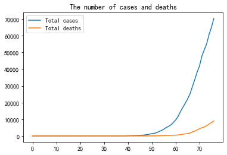
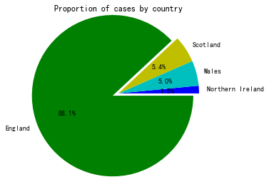
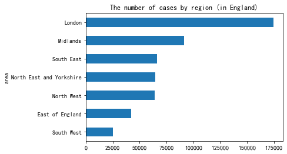
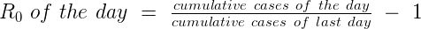
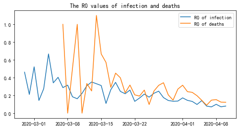
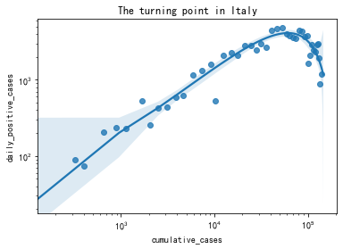
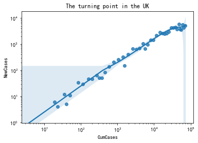
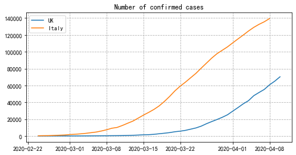
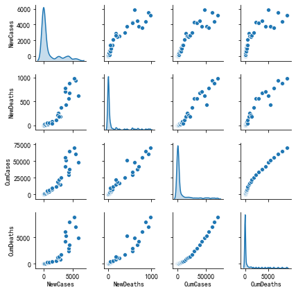

# Data Analysis Report
### *about COVID-19 outbreak in the United Kingdom*
#### Full report is available: https://josephlyu.github.io/Coivd19-UK-Analysis/

## 1. Introduction

Coronavirus disease (***COVID-19***) is caused by the Severe Acute Respiratory Syndrome Coronavirus 2 (SARS-CoV-2) and has had a worldwide effect. On ***March 11 2020***, the World Health Organization (WHO) declared it a ***pandemic***, pointing to the more than 1.6 million cases of the coronavirus illness in over 110 countries and territories around the world at the time.

In this report, I hope to give an overview of ***the pandemic in the UK*** by trying to answer the following questions:
- ***What is the current situation?***
- ***How can we tell if we are succeeding?***
- ***When will we reach the turning point?***

And ***special thanks*** to [Emmadoughty](https://github.com/emmadoughty) and [RamiKrispin](https://github.com/RamiKrispin) for collating and sharing the datasets.

### Some basic information:
#### *1. The total number of confirmed cases and deaths since outbreak*

The graph indicates that the number of confirmed cases began to grow **exponentially** after one and a half months since outbreak (around ***March 10 2020***). One month later (***April 10 2020***), the UK has ***70,272*** confirmed cases and ***8,958*** deaths recorded.

#### *2. Proportions of confirmed cases by country*

As shown above, the vast majority of infections happened in **England**, accounting for **88%** of the total cases, while **Northern Ireland** was least affected with the corresponding figure of **1.5%**.

#### *3. The number of cases by region (in England)*

We can see that **London** has the largest number of confirmed cases among the regions of England, with almost **twice** that of the second most affected region, the Midlands.  

## 2. Current situation and trend estimation
### 2.1 Simplified model of R0
In epidemiology, the basic reproduction number ***(R0)*** of an infection can be thought of as the expected number of cases directly generated by one case.

- If ***R0 > 1***, each existing infection causes more than one new infection. The disease will spread between population and cause an outbreak.
- If ***R0 = 1***, each existing infection causes one new infection. The disease will circulate but it no longer leads to an epidemic.
- If ***R0 < 1***, each existing infection causes less than one new infection. The disease will decline and eventually die out.

The R0 value only applies when everyone in a population is completely vulnerable to the disease (which is the case for a novel coronavirus with no vaccines as of yet). Therefore, all of the goverment's restrictive measures(i.e. ***lockdown***, ***social distancing***) are intended to lower the ***R0*** value until it's ***less than 1***.

With limited epidemiological knowledge and a basic dataset, I will use a very crude model to estimate the reproductive rates and show the general numerical growth trend of confirmed cases and deaths:
- *If we assume every infected person will infect R0 people during one day, we then have:* 

#### *We then plot the graph (from 2020-02-28):*

Despite the simplicity of the formula, there is some information we can gain from this graph:
1. **The situation is getting better.** 
  - *Since the restrictive measures such as social distancing and lockdown were introduced, the R0 values of both infection and deaths have been **gradually decreasing** . This does not mean that the number isn't growing rapidly, but rather that the rate of growth itself is **slowing down**.*
  - *The exact R0 values in the graph are inaccurate. For the purpose of this crude calculation, I assumed the infection period to be 1 day, whereas it is around 10 in reality (there are also many other vital factors I didn't take into consideration). The actual R0 value should be at least few times larger than this graph suggests.*
  - *The graph of deaths was extremely unstable in early March - this was due to the small sample size initially.*
2. **We are not testing enough.** 
  - *We can see that the R0 value for deaths is consistently **higher** than that for infection, when it should be at the same level.This indicates that there are **more infected people** than have been recorded and we are not testing enough.*  

### 2.2 Turning point judgement
In the middle of an exponential curve, it is very hard to tell how it will develop and whether a turning point is approaching. However, for an exponential function *y = f(x)*, if we plot *y values* in the x-axis, and *the changes of x value (i.e. delta x)* in the y-axis, both in ***logarithmic scale***, the resulting graph should be linear.  
This method has provided us with a simple and ***straightforward approach*** to show the trend: 

- *If we plot the total number of cases in the x-axis and the number of new cases in the y-axis (both in logarithmic scale), where a positive **linear** relationship means that the virus is **spreading** and a **drop** indicates that the pandemic is **under control**.*

#### *We use the data in Italy as an example:*

***Italy*** is one of the countries most affected by the coronavirus and currently has the highest death rate, with hundreds of new cases confirmed daily and a huge number of total cases. However, from the graph above we can see that Italy is getting ***out of the crisis*** and the hardest times have passed: the line has dropped off and is ***no longer experiencing exponential growth***.

#### *Now let's have a look at the data in the UK:*

Compared to Italy, the ***UK*** faces a more challenging situation at the moment. There is still ***no clear turning point*** observed in the graph, indicating that the disease is still progressing in line with the ***exponential*** law. However, toward the end of the curve, we can see that the scatter points are more clustered, and the statistical algorithms also simulated a ***downward*** trend. Therefore, with an appropriate degree of caution, I would suggest that we are ***approaching*** the turning point (the peak), although there are uncertainties.

#### *To refine this judgement, we can make further comparisons with Italy:*

Given the information that:
1. The **turning point** of Italy in the first graph happened on around March 25 2020.
2. On March 25 2020, Italy had ***4,492*** new cases, ***74,386*** total cases and ***7,503*** total deaths.
3. As of today (April 10 2020), the UK has ***5,195*** new cases, ***70,272*** total cases and ***8,958*** total deaths.
4. On April 8 2020, the number of new cases in Italy dropped below ***1,000*** for the first time and has kept decreasing.

Combining the data, graphs and anlyses in this section, assuming that the development of coronavirus in the UK will follow a similar pattern to Italy, we have reason to believe that the disease will ***reach a peak*** within the ***next few days*** in the ***UK***, and the daily increase in cases will drop below ***1,000*** within ***the next 25 days***.  

### 2.3 Mortality rate
Finally, we can examine the relationship between infection and mortality.
#### *Plot the graphs for new cases, total cases, new neaths and total deaths:*

From this graph, we can tell that:
1. The mortality rate increased almost ***exponentially*** at the beginning and is still increasing.
2. The mortality rate is growing ***much slower*** than it was initially, but is ***not yet stable***. 
3. The rate of infection is decelerating and is ***almost stable***.

Therefore, we must ***lower the mortality rate*** as a matter of priority.

## 3. Conclusion

This report has examined three aspects of the coronavirus pandemic in the UK, and the conclusions are as follows:
1. **The restrictive measures have worked effectively and we are now fairly close to the peak.**
2. **The daily increase in confirmed cases is very likely to drop below 1,000 within the next 25 days.**
3. **What currently needs to be prioritised is the expansion of testing and the reduction of mortality rate.**

#### Death is not just a statistic, but a real life. 
## STAY AT HOME 
## PROTECT THE NHS
## SAVE LIVES

#### ***Thanks for reading*** *You're welcome to drop any questions: josephlyu.sj@gmail.com*
